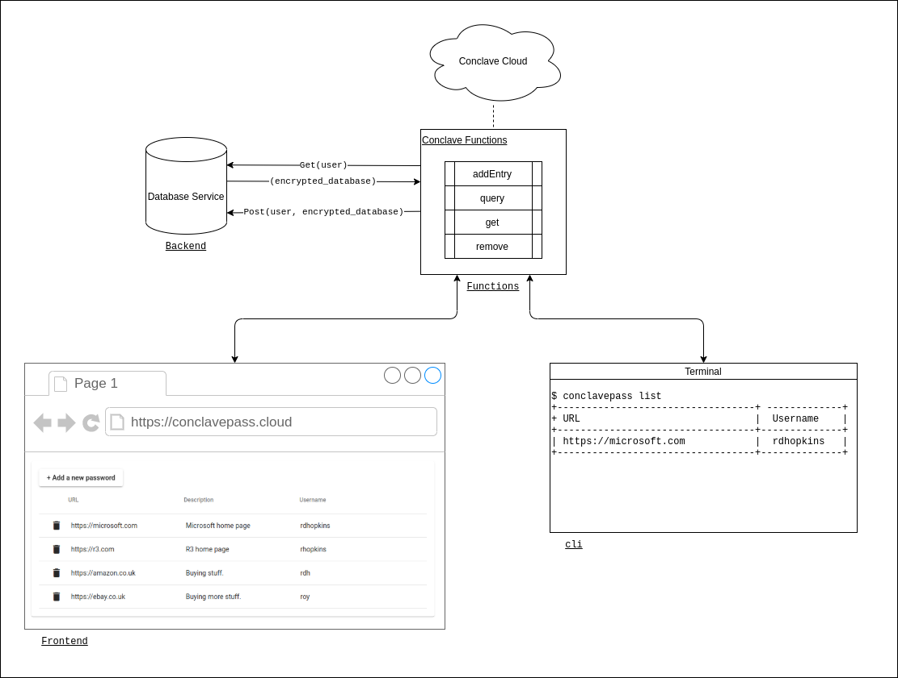
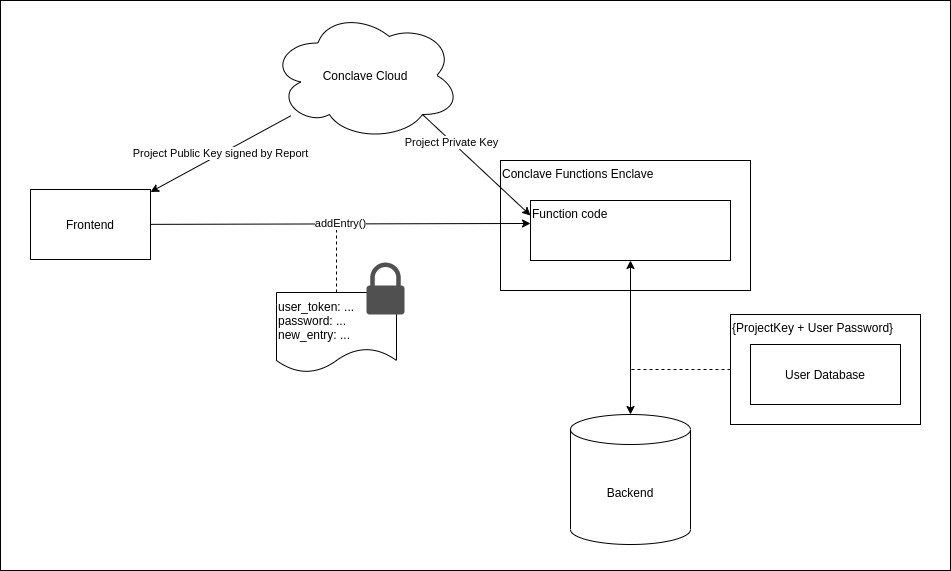

# Conclave Pass - Password Manager implemented using Conclave Cloud
This repository contains a set of projects that together implement a basic
password manager service that demonstrates how to use Conclave Cloud services to
provide a privacy preserving backend to an application.

The end user can interact with the password manager service using both a
web-based frontend implemented with Angular, and a command-line tool written in
Kotlin.

## How do existing password managers work?
Password managers maintain a database of password entries that are all protected
by a single master password or acccess key. It goes without saying that the
password database contains extremely sensitive information that the user wants
to keep private. It is important that even the password manager service
administrators are not able to access entries within the database.

Password managers normally solve this privacy problem by storing the database
using at-rest encryption in a database in the cloud. When the user wants to
access the database on a new device, the cloud copy of the database is
synchronised to the device in its entirety. All operations on the database are
then performed in the client application or web browser.

For example, the architecture used by LastPass is described here: 
https://www.lastpass.com/security/zero-knowledge-security.

This approach is obviously very secure but comes with some limitations:

* If the database grows to a large size then it may take significant network
  bandwidth/storage on the endpoint device.
* There is no opportunity for sharing or collaboration on database entries.

Now, in reality, for password managers these are not real limitations, but for
the purposes of this demonstration project we can see that a Conclave Cloud
based implementation can be used to solve these two issues by accessing the
database inside an SGX enclave in the cloud.

## How is ConclavePass architected?

A diagram showing the architecture of the project is shown below. Each component
in the diagram is named corresponding to the directories in this repository that
contain the implementation for the component.



Each component is described below:

### Functions
The functions consist of a typescript component that provides methods that can
be used to add, query, get and remove entries within the user's database. This
requires access to the unencrypted database and therefore, to ensure privacy,
runtime encryption is used by hosting the functions within Conclave Cloud in the
Conclave Functions service.

Conclave Functions are stateless and do not have access to any persistent
storage. Therefore, external storage within the cloud is necessary in order to
persist the user databases. The functions component uses the JavaScript
`fetch()` built-in capability to query and update an external data store with
each user's encrypted database entries. It is vitally important to ensure that
any data exchanged via `fetch()` is encrypted as the request is made outside the
Conclave Functions Intel SGX enclave. The functions module uses another built-in
function, `crypto.getProjectKey()` to get a key that is unique to the project and
function code and uses this to encrypt/decrypt the user's database prior to
exchanging it with the external storage.

### Backend
The backend service is used to store and retrieve the encrypted database for
each user. It only ever handles data that has been encrypted using a key that
can only be accessed within the functions component, ensuring that no
unauthorised entity can gain access to the user databases.

The simple implementation provided within this project consists of a Spring
application that stores the databases in a key/value map in memory. All entries
are lost if the service is restarted.

### Frontend
The frontend provides a web-browser application that allows login/logout and
management of user keys. This has been implemented using the Angular framework
and demonstrates how the Conclave Cloud JavaScript SDK can be used to interact
with Conclave Functions.

### Cli
The CLI is a terminal-based tool written in Kotlin that allows login/logout and
management of user keys. This demonstrates how the Conclave Cloud Kotlin/Java
SDK can be used to interact with Conclave Functions.

## How is privacy preserved?
With the ConclavePass solution, the only component that has access to the user
databases in an unencrypted form is the function code that runs within the
Conclave Functions service. But how do we ensure that is the case?

Conclave Cloud makes it easy to ensure that only authorised function code can
access data. It does this by running the code within an Intel SGX enclave and
providing an attestation that proves the validity of the platform as well as the
integrity and authenticity of the code running inside the enclave. The details
of this whole process are handled by the Conclave Cloud platform and the client
SDKs.

Let's take a look first at how a user sends a password to the service. The
frontend or CLI will call the `addEntry` function, passing the user's password
and details of the new password entry. This information obviously should not be
sent unencrypted. Furthermore it should be encrypted using a key that is only
accessible to the set of functions that have been approved by the user to handle
the user's database. 



The Conclave Cloud client SDK obtains a public key from the platform that is
signed by a report that proves the private key can only be accessed within an
approved Conclave Functions enclave. The client SDK validates the report and
ensures the key signature does indeed match the signature in the report. Once
this key has been established we can encrypt data using this key safe in the
knowledge that only a valid Conclave Functions enclave can decrypt it.

The password entry is encrypted using this key and the `addEntry` function
invoked. This is then picked up inside a Conclave Functions enclave which can
decrypt the parameters using the private key that only it has access to. The
function retrieves the encrypted user database from the external service.

Once the function has the user's encrypted database it then decrypts it. The key
used to encrypt/decrypt the enclave is derived from a number of sources, all of
which need to be present to obtain the correct key:

1. The Project key - this is the same key that is used to decrypt the function
   code itself and the invocation parameters that were provided to the function.
2. The hash of the code that is executing. By mixing this into the encryption
   key we can assure that if the code is modified or changed then it cannot
   access the database.
3. The user's password - by mixing this in we can assure one user cannot access
   the database for another user.

The function decrypts the database, adds the new entry, re-encrypts it then
sends it back to the backend.

So, we can see that the only entity that has access to all the secrets required
to access each user's database entry is Conclave Functions, and only then when
running the exact same code that the user expects the functions to be running,
and when provided with the user's password.

## Building and deploying the demonstration
Each component must be built and deployed or hosted in order to run the
demonstration.

### 1. Backend
The backend service needs to be available as a fixed IP on the internet in order
to allow Conclave Functions to access it for storing user databases.

It is recommended to set up a new virtual machine with your cloud service
provider to host this. The resource requirements are tiny so you can use the
smallest size of virtual machine your cloud service provider provides.

The service is built using this command:

```
./gradlew build
```

You can then deploy the `build/libs/conclavepass-0.0.1-SNAPSHOT.jar ` file to
your virtual machine and run it with:

```
java -jar ./conclavepass-0.0.1-SNAPSHOT.jar 
```

### 2. Functions
Note down the IP address for the backend service that you have just deployed and
update the functions module to connect to the service with that address in
`functions/src/index.ts`.

Then see the instructions in [functions/README.md](functions/README.md) for
information on how to setup a Conclave Cloud project and build and deploy the
functions ready for use.

### 3. Frontend
The Conclave Cloud JavaScript client SDK is not yet hosted in a public
repository so you will need to download and unzip it locally and update the
frontend project to use your local copy.

Instructions on how to do this and build and run the frontend can be found in
[frontend/README.md](frontend/README.md).

Once the frontend is running you can access it at http://localhost:4200.

### 4. CLI
The Conclave Cloud Java client SDK is not yet hosted in a public repository so
you will need to download and unzip it locally and update the CLI project
to use your local copy.

Instructions on how to do this and build and run the CLI can be found in
[cli/README.md](cli/README.md).

## Usage notes
This is only a demo of a password manager. As such, it provides only very basic
functionality and error handling. There are a few things to note when trying the
demonstration.

### The username is used as the user token
When you enter your username, the name is run through a SHA256 hashing algorithm
and converted to a hex string. This is used as the token for the user. The
backend service stores and retrieves encrypted databases using this token.

### The password is set on first access
The first time a user token is used, there is no entry within the backend
service so it returns an empty string. The functions component assumes this is a
new user and creates an empty database encrypted with the current password. All
subsequent access must use the same password, and the password cannot be
changed.

### Incorrect passwords are not handled well
When an incorrect password is used, the decrypt function returns invalid data
within the functions component. This is not checked and the JavaScript code
subsequently fails. This obviously serves the purpose of protecting the database
but is not a good user experience. This is something that can be improved in the
demonstration code - maybe an exercise for the reader!

### The database is not persisted
As mentioned above, restarting the backend service clears all user data. This is
useful for demonstration purposes but does not make for a very useful password
manager!
